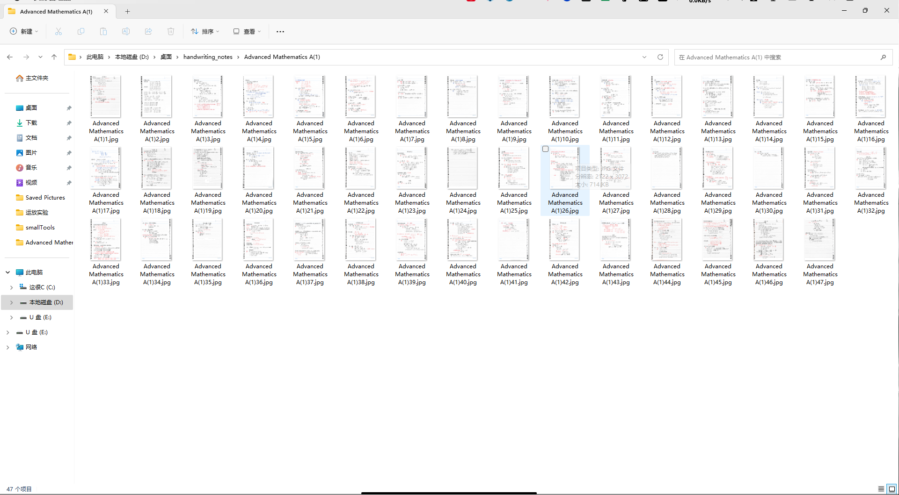
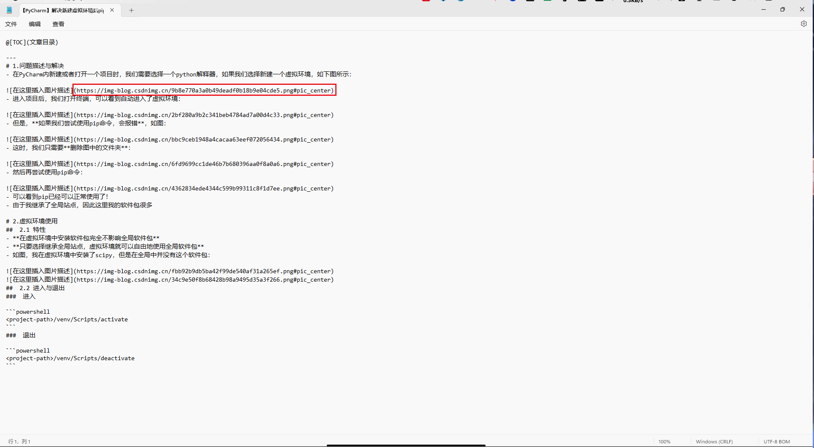
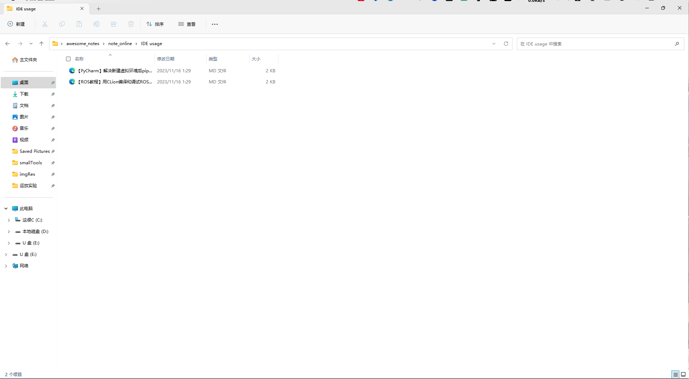
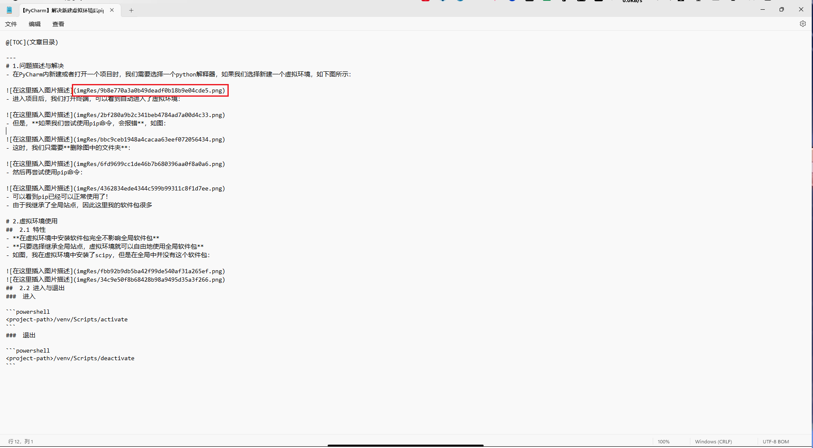
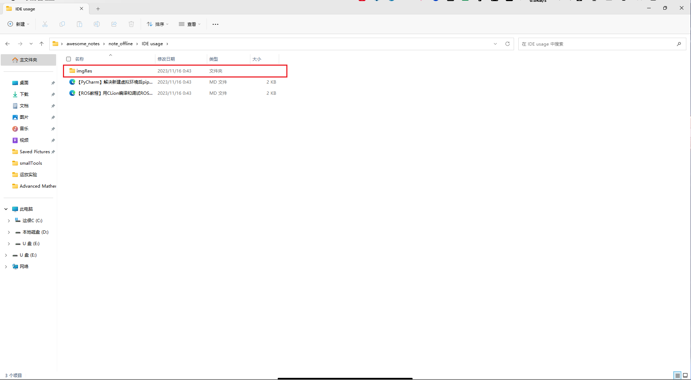

<!-- TOC -->
* [Content](#content)
* [`rename_files`](#rename_files)
  * [by order](#by-order)
  * [by `filename extension`](#by-filename-extension)
  * [result:](#result-)
* [`normalize_md`](#normalize_md)
  * [result:](#result-)
<!-- TOC -->
# Brief
This is a repo of some smallTools created by python.

# `rename_files`
- This tool could rename all the files in a directory decided by you. You have `2` choices to rename them.
## by order
- If you don't mind the `filename extension`, you could rename all of them at one time.**Given New name and order key**, the code will add the order automatically.

```python
import pythonSmallToolsByHanXu.rename_files as rename

if __name__ == '__main__':
    # replace the directory you want to rename
    ex=rename.renamer(r"D:\Desktop\C & C++")
    ex(new_name="demo",order_key=lambda x: int(x[ x.rfind(".")-1 : x.rfind(".")+1] ) )
```

## by `filename extension`
- For example, if you want to rename all the images, you may type in `jpg` or `png` as followed.

```python
import pythonSmallToolsByHanXu.rename_files as rename

if __name__ == '__main__':
    # replace the directory you want to rename
    ex=rename.renamer(r"D:\Desktop\C & C++")
    ex(new_name="demo",target_type="jpg")
```

## result:



# `normalize_md`
- Usually, when we write the md file, the images in the md file are bundled with the internet. If you want to view the images offline, you should download the images at advanced and modify the image-urls in the md file, **which is awful and takes much time!** This tool allow you to download the internal images in the md file automatically so that you could view the md file without the internet anymore!
- **The algorithm is in-place!You'd better copy the md dir in advance.**

```python
import pythonSmallToolsByHanXu.normalize_md as normal

if __name__ == '__main__':
    # replace the directory you want to rename
    target_directory = r"D:\Desktop\demo"
    normal.normalizer(current_dir=target_directory)()
```
## result:
- before:





- after:




